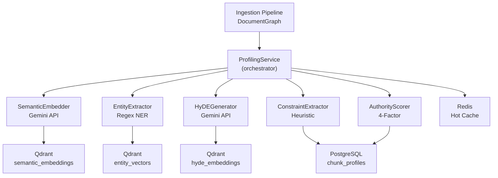

# Expert Profiling Service — Walkthrough

## Overview

Implemented **Layer 4 (Multi-Vector Expert Profiling)** of the HelioX RAG 3.0 architecture. For each chunk from the ingestion pipeline, the service generates and stores multi-vector embeddings, constraint metadata, and authority scores across three storage backends.

---

## Architecture



> Steps 1–5 run **concurrently** via `asyncio.gather`. Steps 6–8 persist results.

---

## Files Created

### Infrastructure

| File | Purpose |
|------|---------|
| [clients.py](file:///c:/HelioX/profiling/clients.py) | Async client wrappers for Qdrant, PostgreSQL, Redis |

### Schema & Models

| File | Purpose |
|------|---------|
| [models.py](file:///c:/HelioX/profiling/models.py) | `ChunkProfile` + `EmbeddingVersion` SQLAlchemy models |
| [schemas.py](file:///c:/HelioX/profiling/schemas.py) | Pydantic DTOs: `ChunkProfileRequest`, `ChunkProfileResult`, `ConstraintMetadata` |
| [qdrant_setup.py](file:///c:/HelioX/profiling/qdrant_setup.py) | 3 Qdrant collections with HNSW config |

### Core Services

| File | Purpose |
|------|---------|
| [embedder.py](file:///c:/HelioX/profiling/embedder.py) | Semantic embeddings via Gemini `gemini-embedding-exp-03-07` |
| [entity_extractor.py](file:///c:/HelioX/profiling/entity_extractor.py) | Regex NER → entity list → entity vector |
| [hyde_generator.py](file:///c:/HelioX/profiling/hyde_generator.py) | Hypothetical question gen via Gemini `gemini-2.0-flash` + embed |
| [metadata_extractor.py](file:///c:/HelioX/profiling/metadata_extractor.py) | Temporal, geographic, applicability scope extraction |
| [authority.py](file:///c:/HelioX/profiling/authority.py) | 4-factor authority scoring (source, depth, position, recency) |

### Orchestration

| File | Purpose |
|------|---------|
| [service.py](file:///c:/HelioX/profiling/service.py) | Main 8-step profiling workflow orchestrator |
| [cache.py](file:///c:/HelioX/profiling/cache.py) | Redis hot cache with TTL, bulk warm, invalidation |
| [tasks.py](file:///c:/HelioX/profiling/tasks.py) | asyncio.Queue background runner with retry |

### Modified Files

| File | Change |
|------|--------|
| [pyproject.toml](file:///c:/HelioX/pyproject.toml) | Added `profiling` dependency group, package discovery |
| [config.py](file:///c:/HelioX/ingestion/config.py) | Added Qdrant, PostgreSQL, Redis, Gemini settings |
| [.env.example](file:///c:/HelioX/.env.example) | Added all new env vars with Gemini API key |

---

## Schema Design

### PostgreSQL: `chunk_profiles`

```
chunk_profiles
├─ id              (PK, UUID)
├─ chunk_id        (UNIQUE, indexed)
├─ document_id     (indexed)
├─ section_id
├─ embedding_model_id / model_version
├─ authority_score (float)
├─ temporal_start / temporal_end (datetime)
├─ geographic_scope (JSON array)
├─ applicability_scope (string)
├─ entity_list     (JSON array)
├─ status          (enum: pending/processing/completed/failed)
└─ profiled_at     (datetime)
```

### PostgreSQL: `embedding_versions`

```
embedding_versions
├─ id, model_id, model_version
├─ dimensions, is_active, created_at
```

---

## Vector Index Config

| Collection | Dimensions | Distance | HNSW m | ef_construct | Payload Indices |
|-----------|-----------|----------|--------|-------------|-----------------|
| `semantic_embeddings` | 768 | Cosine | 16 | 100 | chunk_id, document_id, section_id |
| `entity_vectors` | 768 | Cosine | 16 | 100 | chunk_id, document_id, section_id |
| `hyde_embeddings` | 768 | Cosine | 16 | 100 | chunk_id, document_id, section_id |

---

## Background Processing Architecture

```
BackgroundProfiler
├─ asyncio.Queue (in-process task queue)
├─ N worker coroutines (default: 2)
├─ Per-job retry (max 2 attempts, 1s backoff)
├─ Batch processing (configurable batch_size)
├─ Status tracking via ProfilingJobStatus dict
└─ Graceful shutdown via sentinel values
```

**Usage:**
```python
profiler = BackgroundProfiler(num_workers=2)
await profiler.start()
job_id = await profiler.enqueue(document_id, chunks)
status = profiler.get_status(job_id)
await profiler.stop()
```

---

## Test Results

```
44 passed, 0 failed ✅
```

| Test File | Tests | Status |
|-----------|-------|--------|
| `test_db_init.py` | 1 | ✅ |
| `test_detector.py` | 3 | ✅ |
| `test_ingest_pipeline_txt_html_csv_pdf.py` | 4 | ✅ |
| `test_noise_and_hierarchy.py` | 2 | ✅ |
| `test_profiling_models.py` | 3 | ✅ |
| `test_profiling_service.py` | 31 | ✅ |
