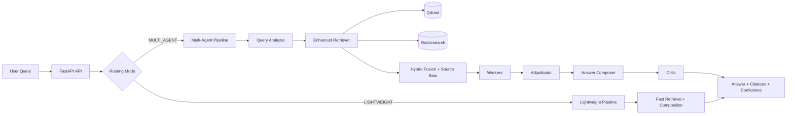

# HelioX RAG

High-accuracy, high-speed, multi-agent Retrieval-Augmented Generation (RAG) system for document-grounded question answering.

HelioX is built for teams that need fast answers with evidence, not guesses.

## Why HelioX

- Multi-agent reasoning pipeline with confidence calibration.
- Hybrid retrieval (dense vectors + BM25 keywords).
- Source-scoped querying to prioritize the currently uploaded document.
- Page-aware PDF ingestion and chunking.
- Citation-first answers with transparent pipeline traces.
- Adaptive routing between lightweight and multi-agent modes.

## Core Capabilities

- Document ingestion: PDF, TXT, MD.
- Query modes:
    - `auto` (complexity-based routing)
    - `multi-agent` (maximum deliberation)
    - `legacy` (compatibility path)
- Retrieval stack:
    - Qdrant vector retrieval
    - Elasticsearch BM25 retrieval
    - Fusion scoring with lexical and source-aware boosts
- Quality controls:
    - Critic verdicts
    - Retry traces
    - Confidence breakdown
- Observability:
    - Telemetry trends
    - Learning dashboard data

## Architecture



## Tech Stack

- Backend: FastAPI, Pydantic, Uvicorn
- Embeddings: sentence-transformers (`intfloat/multilingual-e5-small` default)
- Vector Store: Qdrant
- Sparse Search: Elasticsearch (BM25)
- Caching: Redis (optional)
- UI: React + Vite + Tailwind

## Project Layout

```text
api_server.py                 # FastAPI entrypoint
api/engine/pipeline.py        # Main multi-agent pipeline
core/execution_router.py      # Complexity-aware routing
core/lightweight_pipeline.py  # Fast path execution
services/retrieval/           # Enhanced retriever + ES integration
services/vectorstore/         # Qdrant wrapper
services/embedding/           # Embedding service
agents/                       # Planner, retriever, reasoner, critic, composer
models/schemas/               # Typed schemas
ui/                           # React frontend
logs/                         # Runtime logs and telemetry outputs
```

## Quick Start

### Option A: Run directly (no virtual environment)

1. Install Python dependencies:

```powershell
python -m pip install -r requirements.txt
```

2. Start backend:

```powershell
python api_server.py
```

3. Start frontend:

```powershell
cd ui
npm install
npm run dev
```

4. Open:

- UI: `http://localhost:5173`
- API: `http://localhost:8000`
- Health: `http://localhost:8000/api/health`

### Option B: Windows helper scripts

```powershell
.\setup_venv.ps1
.\run_api.ps1
```

## Configuration

Set these as environment variables or in a `.env` file.

| Variable | Default | Description |
|---|---|---|
| `QDRANT_URL` | in-memory/local behavior | Qdrant URL (cloud or self-hosted) |
| `QDRANT_API_KEY` | empty | Qdrant API key |
| `QDRANT_COLLECTION` | `heliox_chunks_e5` | Vector collection name |
| `EMBEDDING_MODEL` | `intfloat/multilingual-e5-small` | Embedding model |
| `RETRIEVAL_TOP_K` | `50` | Retrieval breadth |
| `GROQ_API_KEY` | empty | Main model API key |
| `GROQ_MODEL` | `qwen/qwen3-32b` | Main model |
| `GROQ_LIGHTWEIGHT_API_KEY` | empty | Lightweight model API key |
| `GROQ_LIGHTWEIGHT_MODEL` | `llama-3.1-8b-instant` | Lightweight model |
| `ELASTIC_SCHEME` | `https` | Elasticsearch scheme |
| `ELASTIC_USER` | `elastic` | Elasticsearch username |
| `ELASTIC_PASSWORD` | empty | Elasticsearch password |
| `ELASTIC_VERIFY_CERTS` | `false` | TLS cert verification |

## API Endpoints

### `POST /api/upload`

Upload and ingest a document.

```bash
curl -X POST "http://localhost:8000/api/upload" \
    -F "file=@Recursive Language Models.pdf"
```

### `POST /api/query`

Ask a question against ingested knowledge.

```bash
curl -X POST "http://localhost:8000/api/query" \
    -H "Content-Type: application/json" \
    -d '{
        "query": "What is observation 2 in the uploaded PDF?",
        "mode": "auto",
        "source_hints": ["Recursive Language Models.pdf"]
    }'
```

### `POST /api/route`

Run auto-routing and return selected mode.

### `POST /api/feedback`

Store user feedback for adaptive tuning.

### `GET /api/telemetry`

Return confidence/hallucination/retry trend data.

### `GET /api/learning`

Return strategy and concept-learning insights.

### `GET /api/health`

Basic health endpoint.

## Retrieval Quality Playbook

To maximize factual accuracy on uploaded PDFs:

1. Re-upload documents after major retriever changes.
2. Send `source_hints` with query requests when possible.
3. Use explicit reference queries:
     - Example: `What does Observation 2 state?`
4. Keep chunk sizes balanced (already page-aware in current ingestion path).
5. Verify citations are present for factual outputs.

## Performance Tips

- Keep embedding model pre-warmed (startup already does this).
- Use `auto` mode for best latency/quality balance.
- Use `lightweight` style routes for simple factual lookups.
- Ensure Qdrant and Elasticsearch are reachable with low network latency.
- Use Redis for cache-heavy workloads.

## Troubleshooting

### Qdrant source filter error

If you see:

`Index required but not found for "source" ...`

HelioX now auto-creates payload indexes for filter fields (`source`, `chunk_index`).

If this appears on older collections:

1. Restart API server.
2. Re-upload at least one document to ensure collection/index path is exercised.
3. Retry query with `source_hints`.

### Retrieval returns generic fallback answers

- Confirm document ingestion succeeded (`chunks_ingested > 0`).
- Confirm query includes enough lexical anchors (`observation 2`, section names, entity names).
- Check `/api/telemetry` for low confidence or high retry rates.

### Elasticsearch returns 0 hits

- Verify ES connection variables.
- Ensure index creation and chunk indexing are successful.
- Retrieval still works via vector search, but hybrid quality will drop.

## Testing and Validation

Run selected scripts:

```powershell
python latency_test.py
python test_execution_router.py
python test_qtypes.py
```

If `pytest` is available:

```powershell
python -m pytest -q
```

## Security and Operations Notes

- Do not commit API keys or credentials.
- Use environment variables for all secrets.
- Restrict CORS origins in production.
- Persist logs and telemetry in managed storage for auditability.

## Roadmap

- Strict citation gating mode (answer only with high-confidence evidence).
- Improved OCR fallback for scanned PDFs.
- Automated benchmark suite for retrieval accuracy and latency tracking.
- Smarter domain-adaptive query rewriting.

## Contributing

1. Create a feature branch.
2. Keep changes focused and test-backed.
3. Open a PR with:
     - What changed
     - Why it changed
     - How it was validated

## License

Add your project license here (for example MIT or Apache-2.0).
