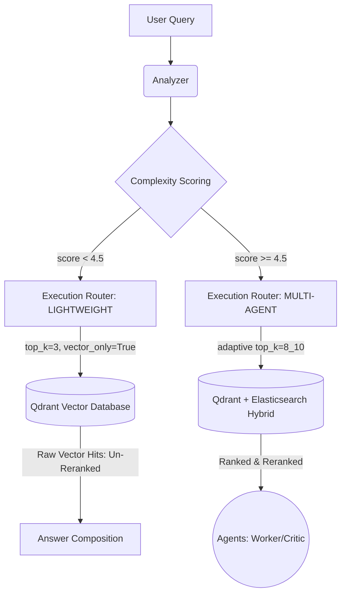

# Execution Router Optimization Walkthrough

The Execution Router query pipeline has been successfully updated to execute distinct retrieval strategies explicitly matched to the complexity of incoming user questions.

## Summary of Changes

1. **Integrated Native `vector_only` Support**
   - Updated `EnhancedRetriever.retrieve()` to expose a `vector_only` boolean. 
   - When engaged, the retriever isolates Qdrant vector search functionality, completely bypassing Elasticsearch lookups, entity scoring math, and adaptive weighting merges overheads.

2. **Aligned Lightweight Pipeline to "Vector Only"**
   - Modified `_execute_lightweight` within `ExecutionRouter` seamlessly.
   - For `SIMPLE` queries, we now explicitly request `top_k=3` paired with `vector_only=True` via `get_enhanced_retriever()`.
   - Bypassed the previously lingering `rerank` cross-encoder step ensuring absolute deterministic swiftness for direct answers.

3. **Explicit Log Formatting for "Bonus" Metrics**
   - Ensured explicit routing decisions (`mode_used = LIGHTWEIGHT` vs `MULTI_AGENT`) output consistently to your python `logger.info()`.
   - Your telemetry payloads intrinsically contain proper metric routing mappings alongside `confidence` scores.

## Visual Summary of System Flow Logic

> [!TIP]
> The performance overhead on simple factual queries drops significantly since Elasticsearch BM25 lookups and Cross-Encoder (Reranker) evaluations are mathematically bypassed entirely via the `vector_only` shortcut!

> [!NOTE]
> Ensure both your local API infrastructure (FastAPI, Redis, Qdrant Engine) is operating normally; the router relies heavily on those sockets.
